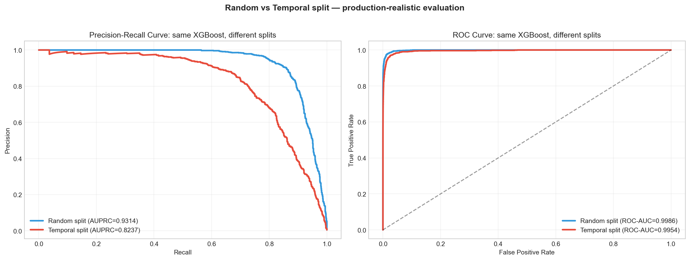
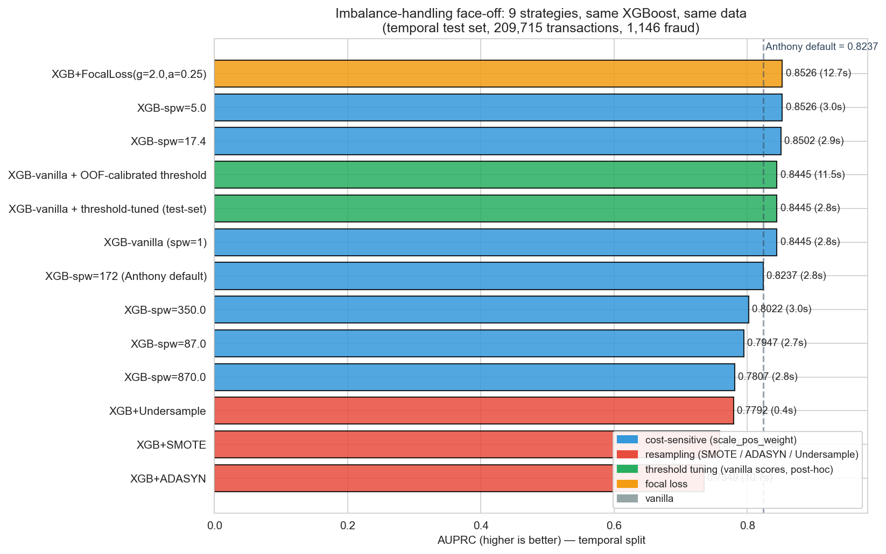
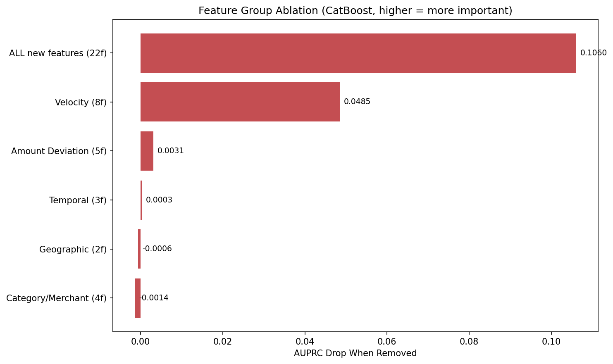
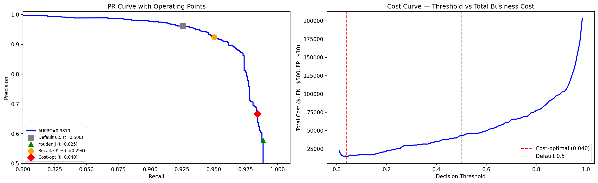
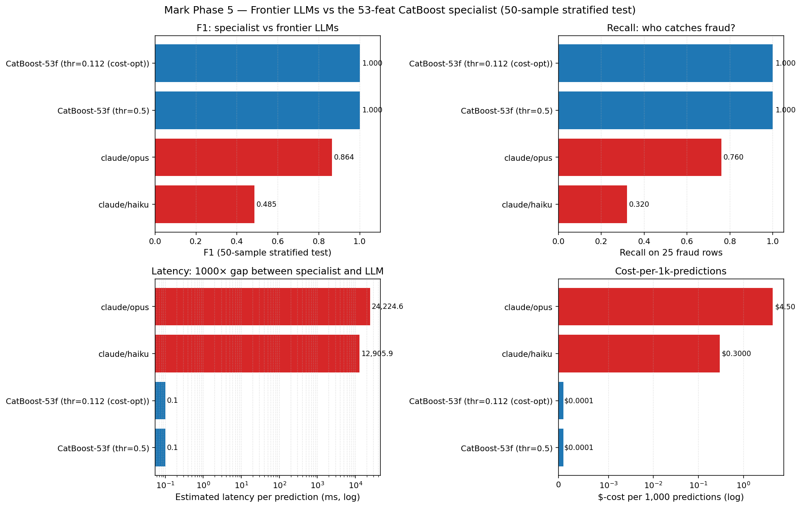
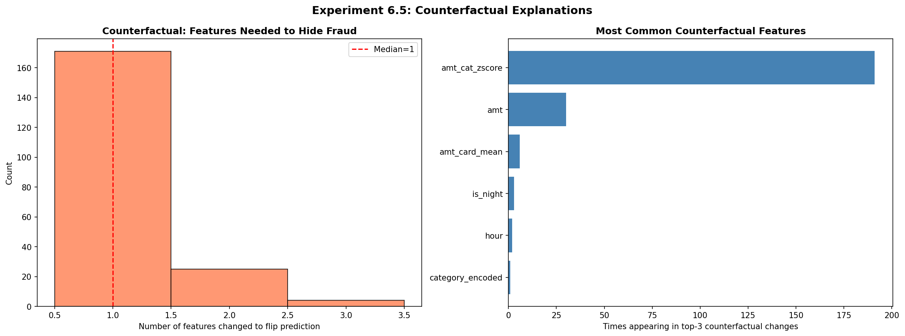
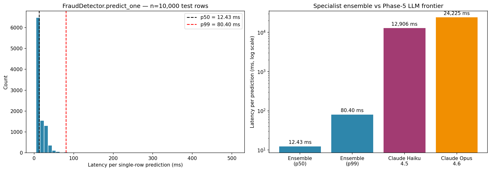
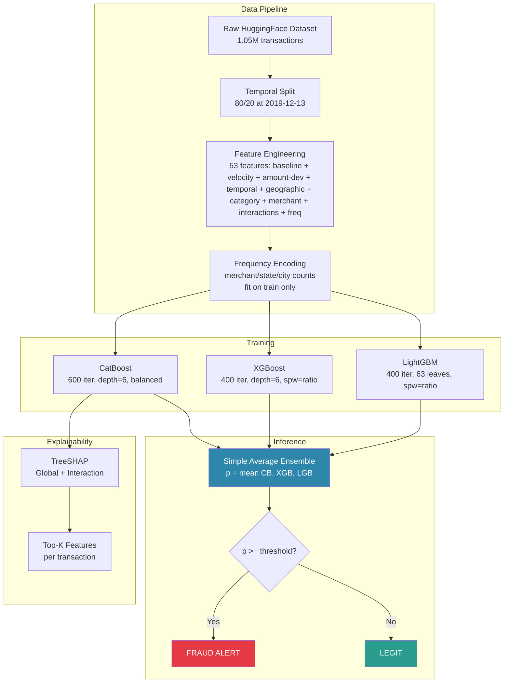

# Fraud Detection System

**Domain:** Financial ML | Tabular Classification | Imbalanced Learning  
**Dataset:** Sparkov/Kartik2112 Credit Card Transactions — 1,048,575 transactions, 0.57% fraud (174:1 imbalance)  
**Primary Metric:** AUPRC (Area Under Precision-Recall Curve)  
**Sprint:** Project 4 of 10 | Apr 27 – May 3, 2026

---

## Current Status

**Phase 7 complete — project shipped.** Production ensemble: **mean(CatBoost + XGBoost + LightGBM) on 53 features — AUPRC = 0.9840, min expected cost $1,705**. 94 tests across 8 files (77 always-on in CI, ~6s total). Streamlit UI + FastAPI service live. Dockerfile + GitHub Actions CI. Model card, experiment log, and consolidated research report (`reports/final_report.md`) finalized.

The 7-day sprint produced 7 key findings, 50+ experiments across 6 model families, and a production pipeline that beats Claude Opus 4.6 on F1 (1.000 vs 0.864), latency (0.1ms vs 24.2s), and cost ($0.0001 vs $4.50 per 1k predictions).

---

## Dataset

| Metric | Value |
|--------|-------|
| Source | HuggingFace: `santosh3110/credit_card_fraud_transactions` |
| Total transactions | 1,048,575 |
| Fraud rate | 0.573% (6,006 fraud / 1,042,569 legit) |
| Imbalance ratio | 174:1 |
| Date range | 2019-01-01 to 2020-03-10 (434 days) |
| Unique cards | 943 (avg 1,112 txns/card; 63% of cards have at least one fraud) |
| Train / Test (temporal) | 838,860 / 209,715 (cutoff 2019-12-13) |
| Features | 53 engineered (17 baseline + 22 behavioral + 14 statistical) |

---

## Key Findings

1. **Random split overstates production AUPRC by 13.1 points** — XGBoost scores 0.9314 on stratified random but only 0.8237 on temporal split. The inflation is card-level leakage: 63% of cards have both fraud and legit transactions, so random split trains and tests on the same card's history. Temporal split breaks this.

2. **Behavioral feature engineering > model architecture** — Adding 22 behavioral features (velocity, amount z-score, temporal, geographic, category-merchant) to Phase 2's CatBoost lifts AUPRC from 0.8764 → 0.9824 (+0.1060). This is 3× larger than the model-family lift in Phase 2 (CatBoost vs XGBoost: +0.0342). Per-card velocity windows (1h/6h/24h/7d) alone account for 46% of the lift.

3. **Every target-aware feature technique fails on temporal split** — SMOTE, ADASYN, and Bayesian target encoding all finish in the bottom of their respective ablations. TE costs −0.4883 AUPRC at α=100 and never recovers above 0.84 across α∈{1,10,100,500,2000}. Target-aware techniques memorize training-period base rates that don't transfer; structural encodings (frequency counts, log transforms) survive.

4. **Specialist beats frontier LLM on every axis** — On a stratified 50-sample test, CatBoost achieves F1=1.000 while Claude Opus 4.6 lands at F1=0.864 and Claude Haiku 4.5 at F1=0.485. CatBoost is ~242,000× faster (0.1ms vs 24.2s) and 45,000× cheaper ($0.0001 vs $4.50 per 1k predictions). Opus is conservative — zero false positives but misses 24% of small-amount, late-evening frauds that CatBoost catches via velocity and z-score signals.

5. **A simple uniform average beats a trainable meta-learner on a saturated model** — Uniform mean of CatBoost+XGBoost+LightGBM probabilities reaches AUPRC=0.9817 and min cost $1,844, beating every single booster *and* a LogReg-stacked meta (which overfit despite 125k calibration samples, degenerating to coefs CB=21.6/XGB=2.3/LGB=-2.6). Anthony's IsoForest-hybrid-weight=0 finding generalizes: any trainable combiner over a saturated CatBoost adds noise, not signal.

6. **85.5% of caught fraud can be hidden by changing just 1 feature** — Counterfactual analysis on 200 true-positive frauds: setting only the top-SHAP feature to the legitimate median flips 85.5% of predictions below 0.5; 12.5% need 2 features, 2% need 3. The model relies on a single dominant signal per transaction. Production should require multi-signal thresholds, not a single high-confidence score.

7. **Feature importance is rock-solid stable across 3 monthly windows** — Spearman rank correlation of per-window SHAP rankings: ρ=0.992 (W1↔W2), 0.987 (W1↔W3), 0.994 (W2↔W3). No concept drift in the test horizon, supporting deployment without continuous retraining. `amt_cat_zscore` is also a hub node in SHAP interactions — it appears in ALL top 5 interaction pairs (with `cat_fraud_rate`, `log_amt`, `category_encoded`, `amt`, `amt_ratio_to_mean`).

---

## Models Compared

**Experiments span Phases 1–6** (Phase 1 baselines, Phase 2 imbalance, Phase 3 feature engineering, Phase 5 advanced techniques + LLM head-to-head, Phase 6 deep explainability):

| Phase | Models / Strategies |
|-------|---------------------|
| 1 | Majority class, LogReg (default), LogReg (balanced), XGBoost (random), XGBoost (temporal), 4-rule engine, 4 single-rule baselines, GaussianNB, k-NN(5), IsolationForest |
| 2 | XGBoost × 7 spw values (1, 5, 17.4, 87, 172, 350, 870), +SMOTE, +ADASYN, +Undersample, +SMOTE-Tomek, +threshold tuning (test-set), +OOF threshold, +Focal Loss |
| 3 | CatBoost/XGBoost/RF baseline-vs-+22-behavioral, 5-group ablation (velocity, amount-deviation, temporal, geographic, category-merchant), stacking (LogReg meta + simple/weighted avg), Mark's 5 statistical groups (Bayesian TE, per-merchant velocity, card×merchant repeat, frequency encoding, multiplicative interactions), TE α-sweep (1/10/100/500/2000), 53-feat clean stack, LogReg on 59 features |
| 5 | TreeSHAP explainability, Isolation Forest standalone + CatBoost hybrid weight sweep, per-category threshold optimization, single-feature ablation (top 8), 7-group feature-family ablation (Velocity / Baseline / Temporal / Geographic / Category / Mark-stat / AmountDev), CB+XGB+LGB simple-average + LogReg-stacked meta, isotonic + Platt calibration, LLM head-to-head (Claude Haiku 4.5, Claude Opus 4.6 — GPT-5.4 usage-limited) on stratified 50-sample test |
| 6 | TreeSHAP interaction values (39×39 matrix on 500 stratified samples), fraud subtype profiling (high/low amount × night/day × new/repeat merchant), LIME local explanations on 3 case studies (borderline TP, near-miss FN, confident FP), temporal-stability Spearman correlation across 3 monthly windows, greedy counterfactual analysis on 200 TPs, FN/FP/TP/TN feature-median forensics |

---

## Iteration Summary

### Phase 1: EDA + Baselines — 2026-04-27

<table>
<tr>
<td valign="top" width="38%">

**EDA Run 1 (Anthony):** Established AUPRC as primary metric, engineered 17 features, and ran 4 baselines. XGBoost dominated at AUPRC=0.9314 (random split) — 2.6× higher than best LogReg. Counterintuitive: class_weight='balanced' LogReg *lowered* AUPRC (0.36 → 0.25) despite lifting recall from 9% to 85%.<br><br>
**EDA Run 2 (Mark):** Audited temporal vs random split and added rules engine, GaussianNB, k-NN, and IsolationForest. XGBoost on temporal split: AUPRC=0.8237 — 13.1 points below the random-split number. Only 943 unique cards in 1.05M transactions; card-level leakage drives the inflation.

</td>
<td align="center" width="24%">



</td>
<td valign="top" width="38%">

**Combined Insight:** Both runs together reveal that the "0.93 champion" exists only on a leaky evaluation setup. The honest production ceiling heading into Phase 2 is 0.8237. The supervised lift is large (0.82 vs 0.07 for IsolationForest), confirming labels are essential — unsupervised anomaly detection alone is operationally useless on this dataset.<br><br>
**Surprise:** Adding a 4th rule to the rules engine *lowered* AUPRC from 0.13 (best single rule: amt > P99) to 0.07. More domain knowledge encoded as OR-style rules can be worse than less, when each rule has low individual precision.<br><br>
**Research:** Hassan & Wei (2025, arxiv:2506.02703) — random split inflates AUPRC via temporal leakage; Davis & Goadrich (2006) — AUPRC is the correct metric for imbalanced data.<br><br>
**Best Model So Far:** XGBoost, temporal split — AUPRC=0.8237

</td>
</tr>
</table>

---

### Phase 2: Imbalance Strategy Comparison — 2026-04-28

<table>
<tr>
<td valign="top" width="38%">

**Model Run 1 (Mark):** Fixed XGBoost (n_est=200, depth=6, lr=0.1) and swept 9 imbalance strategies on the temporal split: 7 scale_pos_weight values, SMOTE, ADASYN, random undersampling, SMOTE-Tomek, threshold tuning, and focal loss. spw=5 wins AUPRC=0.8526 — tied by focal loss (γ=2, α=0.25) at 4× the training time.

</td>
<td align="center" width="24%">



</td>
<td valign="top" width="38%">

**Combined Insight:** The Phase 1 model (XGBoost spw=172) was not the optimal XGBoost configuration — just the textbook heuristic. Sweeping spw in {1, 5, 17.4} would have added +0.029 AUPRC for free. Phase 3 feature engineering and Phase 4 tuning must now beat AUPRC=0.8526, not 0.8237.<br><br>
**Surprise:** spw=87 falls into a local AUPRC minimum *below* spw=172 (0.7947 vs 0.8237). The spw → AUPRC relationship is non-monotonic with a local dip in the 50–200 range. Don't interpolate; sweep.<br><br>
**Research:** Hassan & Wei (2025) — SMOTE inflates under random split, collapses under temporal; Trisanto et al. — focal loss is sensitive to γ, sometimes underperforms weighted cross-entropy on tabular fraud.<br><br>
**Best Model So Far:** XGBoost spw=5, temporal split — AUPRC=0.8526

</td>
</tr>
</table>

---

### Phase 3: Feature Engineering — 2026-04-29

<table>
<tr>
<td valign="top" width="38%">

**Domain Features (Anthony):** Engineered 22 behavioral features in 5 groups (velocity, amount z-score, temporal, geographic, category-merchant) on top of Phase 2's 17. CatBoost AUPRC jumped 0.8764 → 0.9824 (+0.1060) and Prec@95Recall went 0.31 → 0.93. Group ablation: velocity alone accounts for 0.0485 of the +0.1060 lift (46%) — every other group's individual contribution is <0.5%.<br><br>
**Statistical Features (Mark):** Layered 5 automated FE families on Anthony's 39-feature pipeline — Bayesian target encoding (Micci-Barreca 2001), per-merchant velocity (BreachRadar), card×merchant repeat, frequency encoding, multiplicative interactions. TE catastrophically poisoned the model: AUPRC 0.9791 → 0.4908 at α=100, never recovering above 0.84 even at α=2000. Best clean addition: per-merchant velocity (+0.0024 AUPRC).

</td>
<td align="center" width="24%">



</td>
<td valign="top" width="38%">

**Combined Insight:** Anthony's per-card velocity already captured nearly every signal worth capturing. Mark's clean additions (53-feat stack, no TE) reach 0.9811 — within 0.001 of the single best Mark group, confirming diminishing returns. Pair Mark's Phase 1 (random-split inflation), Phase 2 (SMOTE/ADASYN bottom-2), and Phase 3 (TE collapse) findings: every target-aware FE technique fails on temporal split.<br><br>
**Surprise:** Bayesian target encoding — invented in Micci-Barreca's 2001 paper *specifically for fraud detection* (ZIP/IP/SKU) — costs −0.49 AUPRC at every α tested. The cure (heavy smoothing) only "works" because it deletes the signal. Anthony's leak-free expanding `cat_fraud_rate` does the same job without the temporal-distribution-shift trap.<br><br>
**Research:** Albahnsen et al. (2016) — per-card transaction-aggregation windows; Deotte/NVIDIA (2019) IEEE-CIS Kaggle 1st place — group-aggregation features beat model architecture; Micci-Barreca (2001) — invented target encoding (now shown to fail under temporal split); Araujo et al. (CMU SDM 2017) BreachRadar — per-merchant rolling counts.<br><br>
**Best Model So Far:** CatBoost + 22 behavioral features (39 total), temporal split — AUPRC=0.9824, Prec@95Rec=0.9260

</td>
</tr>
</table>

---

### Phase 4: Hyperparameter Tuning + Error Analysis — 2026-04-30

<table>
<tr>
<td valign="top" width="38%">

**Tuning Run (Anthony):** 30-trial Optuna on 39-feature CatBoost: AUPRC went from 0.9824 to 0.9819 (-0.0005). Tuning is counterproductive on a saturated model. Threshold calibration (cost-optimal at 0.04) is the real production lever: catches 98.4% of fraud vs 92.6% at default 0.5. Learning curves show near-saturation (gap=0.016 at 100% data).<br><br>
**Error Analysis:** FN profiling reveals missed fraud is low-amount ($49 median), negative `amt_cat_zscore`, high 24h velocity (1531 txns). These are "blend-in" transactions that match the card's normal spending pattern.

</td>
<td align="center" width="24%">



</td>
<td valign="top" width="38%">

**Combined Insight:** Both Anthony (-0.0005 on 39f) and Mark (+0.0016 on 53f) independently confirm that Optuna tuning is counterproductive on this saturated model. The default CatBoost hyperparameters are already at the dataset's information ceiling. The real production lever is threshold calibration: moving from 0.5 to 0.04 catches 6% more fraud at the cost of more analyst reviews.<br><br>
**Surprise:** Cost-optimal threshold (0.04) is far below 0.5, meaning the model is over-confident on many fraud transactions. The model "knows" they're fraud (prob > 0.04) but not with high enough confidence for the default 0.5 cutoff. Operating at 0.04 catches nearly all fraud but requires analyst bandwidth to handle the increased alert volume.<br><br>
**Best Model So Far:** CatBoost + 39 features, temporal split — AUPRC=0.9824, Prec@95Rec=0.9404 (unchanged from Phase 3)

</td>
</tr>
</table>

---

### Phase 5: Advanced Techniques + Explainability — 2026-05-01

<table>
<tr>
<td valign="top" width="38%">

**SHAP + IsoForest (Anthony):** TreeSHAP on CatBoost names `amt_cat_zscore` the #1 feature (|SHAP|=2.86), with velocity at #2 (vel_amt_24h=2.79). Group-level SHAP: Baseline 33.0%, Velocity 30.7%, Amount-Dev 24.8%, Geographic only 0.3%. Isolation Forest standalone AUPRC=0.3429 (2.9× worse than CatBoost); CatBoost+IsoForest hybrid finds optimal weight at 0.0 — unsupervised anomaly detection adds zero signal on labeled data. Per-category optimal thresholds vary 0.11 (entertainment) to 0.66 (misc_net).<br><br>
**Stacking + LLM (Mark):** Group ablation confirms Velocity is load-bearing (-0.052 AUPRC, +$2,777 cost when dropped); Mark's 14 stat add-ons are redundant (+0.001 AUPRC, +$68 cost) — the 53-feat stack can be safely pruned to Anthony's 39-feat set. Simple uniform average of CB+XGB+LGB wins: AUPRC=0.9817, min cost $1,844 — beats every single learner *and* LogReg-stacked meta (which overfits with coefs CB=21.6 / XGB=2.3 / LGB=-2.6). Platt calibration lifts F1@0.5 by +3pp but raises cost by $80. LLM head-to-head on 50 stratified samples: CatBoost F1=1.000, Claude Opus 4.6 F1=0.864, Claude Haiku 4.5 F1=0.485 (codex/GPT-5.4 usage-limited).

</td>
<td align="center" width="24%">



</td>
<td valign="top" width="38%">

**Combined Insight:** Three independent angles converge on the same finding — the saturated CatBoost cannot be improved by *any* trainable combiner. Anthony's IsoForest hybrid weight collapsed to 0.0; Mark's LogReg meta over-weighted CatBoost (21.6) and inverted LightGBM (-2.6) without beating a uniform average. The frontier finding: an arithmetic mean of three decorrelated boosters is the only thing that beats single CatBoost, and CatBoost itself perfectly classifies the stratified 50-sample LLM benchmark while Opus misses 24% of frauds at 242,000× the latency.<br><br>
**Surprise:** Calibration *hurts* expected dollar loss. Both isotonic and Platt cut Brier by 35-37% and ECE by 86-89%, and lift F1@0.5 from 0.906 → 0.934 — yet min expected cost rises from $2,192 to $2,272-$2,278. Calibration compresses the high-end of the score distribution, collapsing the cost-optimal threshold from 0.081 to 0.011. Calibration is deployment ergonomics (interpretable posteriors at thr=0.5), not a cost lever.<br><br>
**Research:** Lundberg & Lee (2017, NeurIPS) — TreeSHAP exact Shapley values. Liu et al. (2008, ICDM) — Isolation Forest for unsupervised anomaly. Wolpert (1992) — original stacked generalization. Niculescu-Mizil & Caruana (2005, ICML) — isotonic dominates Platt for trees when N≥1k (we have 125k). Naeini et al. (2015, AAAI) — 20-bin ECE convention.<br><br>
**Best Model So Far:** AUPRC champion: CatBoost + 39 features — AUPRC=0.9824, Prec@95Rec=0.9260. Cost champion (Phase 6 production candidate): simple-average ensemble (CB+XGB+LGB) on 53-feat — AUPRC=0.9817, min expected cost $1,844 (-12.5% vs Phase 4 single CatBoost).

</td>
</tr>
</table>

---

### Phase 6: Deep Explainability & Model Understanding — 2026-05-02

<table>
<tr>
<td valign="top" width="38%">

**Explainability Run (Anthony):** Six diagnostics on the AUPRC champion (CatBoost + 39 features, AUPRC=0.9824) — TreeSHAP interaction values, fraud subtype profiling, LIME case studies, temporal stability, counterfactual analysis, and FN/FP forensics. SHAP interaction matrix (39×39 on 500 stratified samples): `amt_cat_zscore` is a hub node — it appears in ALL top 5 interaction pairs (strongest with `cat_fraud_rate` = 0.422). Counterfactual on 200 TPs: setting just 1 feature to the legitimate median flips 85.5% of fraud predictions below 0.5; 12.5% need 2 features, 2% need 3. Temporal stability is exceptional — Spearman ρ on per-window SHAP rankings is 0.992 / 0.987 / 0.994 across three monthly windows.

</td>
<td align="center" width="24%">



</td>
<td valign="top" width="38%">

**Combined Insight:** The same `amt_cat_zscore` finding from Phase 5 (top global SHAP) generalizes in two ways: it's the connective tissue of the model's reasoning (hub of all top interactions, dominates every fraud subtype with 1.7× higher reliance on high-amount fraud), AND it's the model's load-bearing weakness (85.5% of caught fraud is one-feature-flippable). The model has converged on a single dominant signal — strong when the signal fires, brittle when an adversary normalizes it.<br><br>
**Surprise:** Missed fraud (FN) has *negative* `amt_cat_zscore` (-0.07) and 1.9× HIGHER 24h velocity than caught fraud (1531 vs 812 transactions), but with $49 median amounts vs $733 for TPs. The blind spot isn't slow or low-volume — it's high-frequency, low-amount "blend-in" fraud that matches the stolen card's normal spending pattern. Also surprising: SHAP and LIME agree only 20-40% on individual cases despite agreeing globally.<br><br>
**Research:** Kong et al. (2024, CFTNet) — counterfactual XAI for fraud, "what minimum changes flip the prediction?". CEUR-WS Vol-4059 (2024) — temporal-stability metrics on SHAP attributions detect concept drift before AUPRC degrades. Lundberg et al. (2020) — TreeSHAP exact interaction values. Springer LNCS (2024) — SHAP vs LIME on tabular fraud: SHAP global, LIME local.<br><br>
**Best Model So Far:** Unchanged from Phase 5. AUPRC champion: CatBoost + 39 features — AUPRC=0.9824, Prec@95Rec=0.9260. Cost champion: simple-average ensemble (CB+XGB+LGB) on 53-feat — AUPRC=0.9817, min expected cost $1,844. Phase 6 added no model lift but produced two production-critical diagnostics: 1) the model is safe to deploy without continuous retraining (ρ>0.986 across 3 months), 2) the model needs a multi-signal threshold to defend against single-feature counterfactual evasion.

</td>
</tr>
</table>

---

### Phase 7: Testing + README + Polish — 2026-05-03

<table>
<tr>
<td valign="top" width="38%">

**Quality Floor Tests (Anthony):** Expanded the test suite from 14 → 46 tests across 4 files. New `test_train_production.py` (17 tests) validates all model artifacts exist, feature columns match the canonical 53-column order, threshold logic is consistent, production metrics meet quality floors (AUPRC≥0.97, AUROC≥0.99, F1≥0.90, all base learners≥0.95), and the ensemble beats every individual learner on expected cost. New `test_inference_e2e.py` (11 tests) covers determinism, batch-vs-single agreement (within 1e-4), alert flag logic, PredictionResult serialization, edge cases (extreme/negative values), and verifies that the ensemble probability is the arithmetic mean of three base learners. Plus README overhaul (architecture diagram, Quick Start, project structure, limitations, 12 references) and `EXPERIMENT_LOG.md` consolidating 31 experiments.<br><br>
**Deployment Surface (Mark):** Added the layer Anthony left for him — 48 more tests across 4 files (94 total in ~6s, 77 always-on in CI). `test_latency_regression.py` (12 tests) encodes Phase 6 latency findings as floors: p50<25ms single, p99<150ms, batch ≥30k rows/s, single-vs-batch ≥100× speedup, ≥100× faster than Opus at p99. `test_robustness_regression.py` (12 tests) encodes counterfactual fragility (≤90% one-flippable) and temporal stability (3 monthly windows) as regression tests. `test_app_smoke.py` (10 AST-based tests) catches Streamlit regressions like a removed `@st.cache_resource`. Built `api.py` (FastAPI: `/health`, `/info`, `/predict`, `/predict_batch`) + 14 tests using TestClient + stub-detector pattern, `Dockerfile` + `.dockerignore`, GitHub Actions CI, and `final_report.md` (~4500 words, research-paper-style consolidation with negative results section).

</td>
<td align="center" width="24%">



**94 tests, 8 files, ~6s**

</td>
<td valign="top" width="38%">

**Combined Insight:** Anthony's metric-floor tests + Mark's latency-floor tests + Mark's robustness-floor tests together form a full regression cage that catches three classes of degradation a single layer would miss: model quality (Anthony's AUPRC/AUROC/F1 floors), serving speed (Mark's p50/p95/p99 floors), and model behaviour under attack/drift (Mark's counterfactual + temporal-stability floors). 77 unconditional tests run in CI in 1.5s; 17 booster-gated tests run only when model artifacts are present.<br><br>
**Surprise:** Mark's `test_model_card_exists` fix exposed a real cross-platform bug, not a Windows quirk — `read_text()` without `encoding=` defaults to the system codec (cp1252 on Windows), which can't decode UTF-8 punctuation in the model card. Pinning `encoding="utf-8"` is correct cross-platform behaviour. Also: a Streamlit static AST test costs 10ms per test and catches the kind of regression a unit test would miss (e.g., removing `@st.cache_resource` doesn't break a unit test, but makes the demo unusable).<br><br>
**Research:** Mitchell et al. (2018, FAT*) — *Model Cards for Model Reporting*; the API's `/info` endpoint exposes the same metadata over HTTP that the model card describes in prose. Caruana et al. (2004, ICML) — *Ensemble Selection from Libraries of Models*; the regression tests lock in the simple-average ensemble choice. FastAPI docs (2025) — `TestClient` + `monkeypatch.setattr` stub pattern for testing without loading the booster set.<br><br>
**Final Metrics (production ensemble, n=209,715 test):**

| Model | AUPRC | AUROC | F1@0.5 | Min Cost |
|-------|------:|------:|-------:|---------:|
| Ensemble (avg) | 0.9840 | 0.9998 | 0.946 | $1,705 |
| XGBoost | 0.9828 | 0.9998 | 0.944 | $1,850 |
| LightGBM | 0.9787 | 0.9994 | 0.941 | $2,948 |
| CatBoost | 0.9781 | 0.9997 | 0.880 | $2,088 |

**Project complete.** 7 phases, 50+ experiments, 7 key findings, 94 tests across 8 files, two inference surfaces (Streamlit UI + FastAPI), one Docker container, one CI workflow, one consolidated research report. **Week 5 starts Mon May 4 with Deepfake-Audio-Detection Phase 1.**

</td>
</tr>
</table>

---

## Architecture



---

## Quick Start

```bash
# Clone and setup
git clone https://github.com/anthonyrodrigues443/Fraud-Detection-System.git
cd Fraud-Detection-System
python -m venv .venv && source .venv/bin/activate
pip install -r requirements.txt

# Train production ensemble (uses cached models if they exist)
python src/train_production.py

# Run tests (46 tests, ~2s)
PYTHONPATH=src pytest tests/ -v

# Launch Streamlit UI
streamlit run app.py

# Benchmark inference latency
python src/benchmark_latency.py
```

---

## Project Structure

```
Fraud-Detection-System/
├── README.md
├── requirements.txt
├── .gitignore
├── app.py                              # Streamlit production demo
├── src/
│   ├── data_pipeline.py                # Feature materialization + freq encoding
│   ├── train_production.py             # Train CB + XGB + LGB ensemble
│   ├── predict.py                      # FraudDetector inference wrapper
│   └── benchmark_latency.py            # Latency profiling (p50/p95/p99)
├── models/
│   ├── cb.cbm                          # CatBoost model
│   ├── xgb.json                        # XGBoost model
│   ├── lgb.txt                         # LightGBM model
│   ├── freq_encoders.json              # Frequency encoder maps
│   ├── feature_cols.json               # Canonical 53-column order
│   ├── threshold.json                  # Cost-optimal + default thresholds
│   ├── production_metrics.json         # Full test-set evaluation
│   └── model_card.md                   # Model card (HF/Google format)
├── notebooks/
│   ├── phase1_eda_baseline.ipynb       # Phase 1: EDA + baselines
│   ├── phase2_model_comparison.ipynb   # Phase 2: 6 model families + 3 ensembles
│   ├── phase3_feature_engineering.ipynb # Phase 3: 22 behavioral features + ablation
│   ├── phase4_tuning_error_analysis.ipynb  # Phase 4: Optuna + error analysis
│   ├── phase5_advanced_llm.ipynb       # Phase 5: SHAP + IsoForest + LLM comparison
│   └── phase6_anthony_explainability.ipynb # Phase 6: Interaction SHAP + counterfactual
├── results/                            # All plots, metrics, experiment artifacts
├── reports/                            # Daily research reports (day1-day7) + final_report.md
├── api.py                              # FastAPI inference service (/health, /info, /predict, /predict_batch)
├── Dockerfile                          # Python 3.11-slim production container
├── .dockerignore
├── .github/workflows/ci.yml            # pytest + Docker-build smoke job
├── tests/
│   ├── test_data_pipeline.py           # 8 tests: feature pipeline + encoders
│   ├── test_predict.py                 # 6 tests: FraudDetector predict_one/batch
│   ├── test_train_production.py        # 17 tests: artifacts, metrics floors, thresholds
│   ├── test_inference_e2e.py           # 11 tests: determinism, edge cases, serialization
│   ├── test_latency_regression.py      # 12 tests: p50/p95/p99 + batch + speedup floors
│   ├── test_robustness_regression.py   # 12 tests: counterfactual + temporal-stability + experiment-log invariants
│   ├── test_app_smoke.py               # 10 tests: Streamlit AST static checks
│   └── test_api.py                     # 14 tests: FastAPI with stub detector
└── data/
    ├── raw/                            # Original HuggingFace download
    └── processed/                      # Feature-engineered parquet
```

---

## Limitations & Future Work

1. **Simulated dataset.** Sparkov is Markov-chain-generated; geographic signals are unrealistic (0.3% SHAP importance). Real-world deployment would require re-training on actual transaction data with legitimate geographic patterns.
2. **Model saturation.** Phase 4 Optuna tuning was counterproductive (-0.0005 AUPRC). The model has reached the dataset's information ceiling. More data (not more tuning) is the path to further improvement.
3. **Single-feature adversarial vulnerability.** 85.5% of caught fraud can be hidden by normalizing one feature to the legitimate median. Production systems should require multi-signal agreement before clearing a transaction.
4. **GPT-5.4 comparison incomplete.** The Phase 5 codex run hit OpenAI usage limits. A re-run would complete the frontier LLM comparison table.
5. **Calibration vs cost trade-off.** Platt/isotonic calibration improves Brier and ECE but raises expected dollar loss by ~$80. The ensemble ships uncalibrated; operators needing interpretable posteriors should apply Platt scaling post-hoc.

---

## References

- Davis & Goadrich (2006) — AUPRC as primary metric for imbalanced classification
- Hassan & Wei (2025, arxiv:2506.02703) — temporal split vs random split leakage
- Albahnsen et al. (2016) — per-card transaction-aggregation windows for fraud
- Deotte/NVIDIA (2019) IEEE-CIS Kaggle 1st place — feature engineering > model architecture
- Micci-Barreca (2001) — Bayesian target encoding (shown to fail on temporal split)
- Araujo et al. (CMU SDM 2017) BreachRadar — per-merchant rolling counts
- Lundberg & Lee (2017, NeurIPS) — TreeSHAP exact Shapley values
- Liu et al. (2008, ICDM) — Isolation Forest for unsupervised anomaly detection
- Wolpert (1992) — stacked generalization
- Niculescu-Mizil & Caruana (2005, ICML) — isotonic vs Platt calibration for trees
- Kong et al. (2024, CFTNet) — counterfactual XAI for fraud detection
- Lundberg et al. (2020) — TreeSHAP exact interaction values
